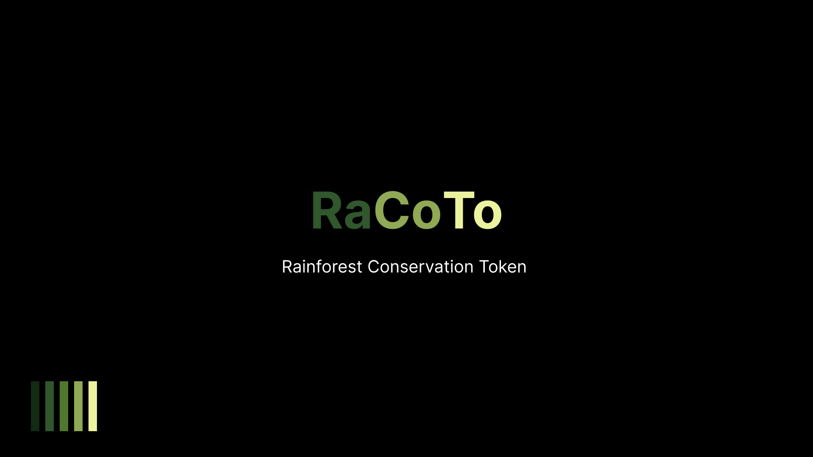
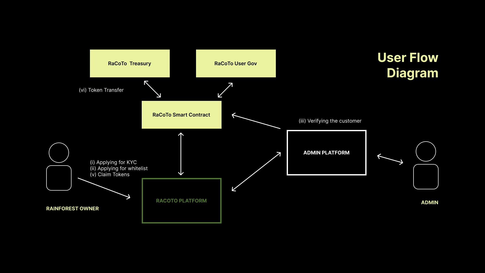

# RaCoTo (Rainforest conservation token)

**Forest preservation verified by Cryptographic Truth**



A project that rewards rainforest owners with tokens for preserving their land, helping fight climate change and protect biodiversity.Tokens representing one ton of fixed carbon dioxide, given to registered rainforest owners for conservation efforts. By registering your rainforest with the project and preserving it, you'll receive RaCoTo tokens based on real-time satellite monitoring. They rely on public, tamper-proof blockchain and independent satellite data, ensuring superior integrity and transparency compared to other offsets.

## Contract Address

We are using polygon mumbai 💜 chain for deployment of our infrastructure.

```sh
CONTRACT ADDRESSES (POLYGON MUMBAI)
RaCoTo: 0x7ae866bF6C7432D0f4A24d01D24a239c9FDaacBC
RaCoToGov: 0x99BD41871A3F1E9Cb5a15545aD9265bB87DDcA5A
RCToken: 0x7128cDaf9391E66d29dc286A6dDb6bD20F97Da6b
Treasury: 0xf68B22ec17f9Da8551f8AECE4dBBe940c35Ae3C7
```

## Tech Used

#### Backend & Frontend

- NodeJS
- TypeScript
- MongoDB
- NextJS

#### Smart Contract

- Solidity
- Chainlink Functions
- Hardhat

## How it works ?



1. **Applying for KYC** 📝 :
   User needs to apply for the KYC when it is reaching for the first time. User needs to upload the land ownership proof, land image and the coordinates.
2. **Applying for whitelist** 🔑 :
   User should apply for the whitelist and wait for the admin to approve it.
3. **Verifying the customer** 👨‍💻 :
   Admin will verify the customer and then the user will be able to claim the tokens.
4. **Token Transfer** 🪙 :
   The treasury will take the 1% of the tokens that user will get after registering.
5. **Claim tokens** 🧾 :
   User can claim the tokens after he/she/they are eligible to do.

## Steps Involved

### Register 👨‍💻

Join our platform, register an account, and be part of the global movement preserving rain forests and earning rewards.

### Persist 🌳🌲

Preserve rainforest treasures by maintaining boundaries, playing a crucial role in their integrity and long-term conservation.

### Earn 💶

Contribute to rainforest protection, combat climate change, and earn rewards by actively participating in conservation efforts.

## What we are solving ?

### PROBLEM 🤷‍♂️

The current Voluntary carbon market (VCM) is hard to access both for individuals and businesses. It lacks transparency,traceability and contains many low-quality carbon compensation projects.

### Our Solution 💡

Carbon compensation with RaCoTo is easy, fast and transparent because we utilise blockchain technology. Everyone can compensate for their CO2 footprint instantly, from anywhere in the world, leaving a immutable and ​​traceable record.
